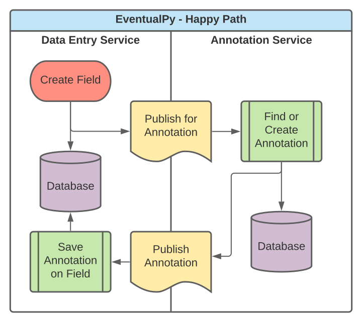
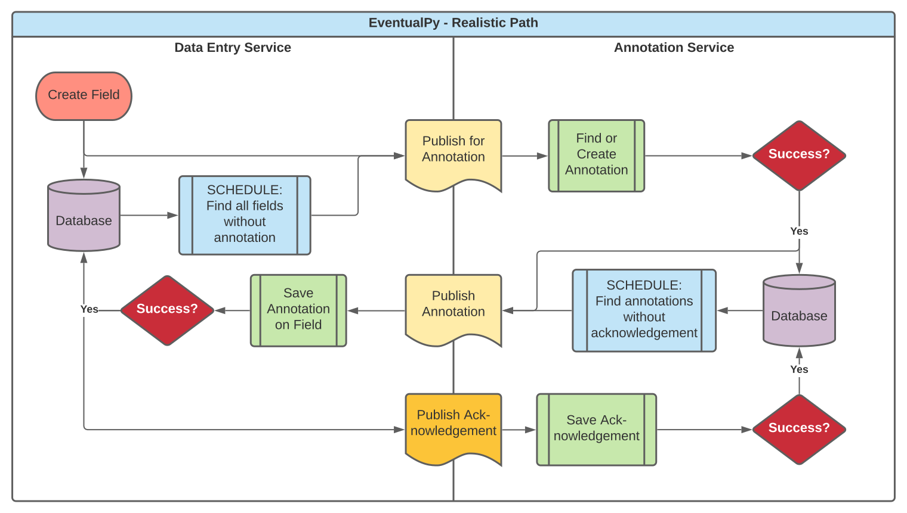

# EventualPy
A python asyncio exercise in eventual consistency.

Ported from an older C# implementation: [Eventually](https://github.com/david-a-jetter/Eventually)

# Domain
The domain orientation is a business environment that contains two primary actor services:

1. Data Entry Service that generates fields requiring some form of annotation
2. Annotation Service that will provide annotations for any field

The goal is to ensure that all created fields are eventually annotated, with mathematical confidence. 
The following flows are implemented to achieve that goal:
* Event Based (Just-in-Time)
  * Publishing new fields for annotation
  * Publishing new annotations for created fields
  * Acknowledging annotations successfully saved in the Data Entry Service
    
* State Based (Batch retry)
  * Republishing unannotated fields for annotation
  * Republishing unacknowledged annotations for created fields
    
# Business Flows

## Happy Path

## Realistic Path

# Exercise

The [demo.py](EventualPy/demo.py) orchestrates a distributed service architecture within a single process. 
The following variables are used to adjust the time required to achieve eventual consistency between the two services.

* The number of fields to create, along with the interval for creating them
* The rate of republishing unannotated fields from the Data Entry Service
* The rate of republished unacknowledged annotations from the Annotation Service
* The rate of failure for each of the following operations:
    * Generating annotations for fields published from the Data Entry Service to the Annotation Service
    * Saving annotations published from the Annotation Service to the Data Entry Service
    * Processing acknowledgements from the Data Entry Service of successfully saved annotations
    
# Execution
## Dependencies
* Python 3. Tested against 3.9.1. Compatibility in older runtimes is not guaranteed
  * asyncio `create_task` is used, which required 3.7+
* Poetry for package installation: https://python-poetry.org/

## Running the demo
1. `poetry install`
1. `poetry run python` (this ensures the poetry-managed venv is used)
1. `from EventualPy.demo import main`
1. `main()`

If you do not modify any of the exercise parameters, 
the program will print the state of the system every second, 
until consistency is reached.

# Libraries Used

* asyncio: https://docs.python.org/3/library/asyncio.html
  * Used to generate the concurrency and asynchronous simulation
* pydantic: https://pydantic-docs.helpmanual.io/
  * Provides simple data modeling (and a lot more!) for Python 3.6+
* rxpython: https://rxpy.readthedocs.io/en/latest/
  * Used to schedule republication routines and state evaluation

# Future Enhancements

1. Tests! Not fun in a demo, but fun in real life
1. Extract configurable inputs to a config file
1. Object versioning of `DataEntryField` instances, to require re-annotation
1. Support for replacing an existing annotation initiated by the Annotation service
1. Support for multiple annotations per `DataEntryField`
1. Consider storage optimizations, eg: split acked and unacked annotations
